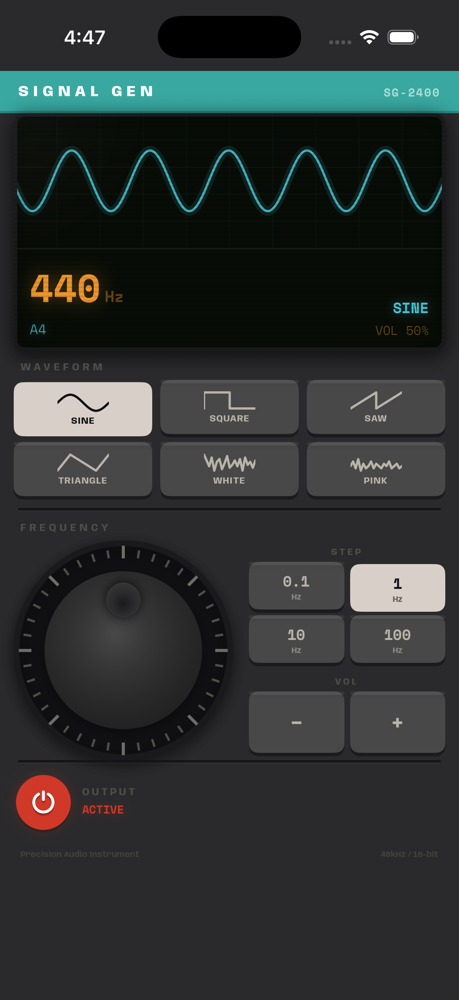
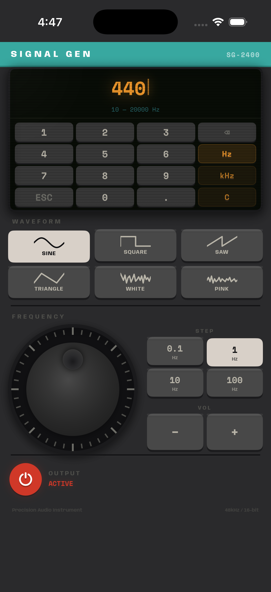

# Signal Generator

A precision audio signal generator for iOS with a retro hardware aesthetic.

  
  

## Features

- **Tone generation** — Sine, Square, Sawtooth, and Triangle waveforms from 10 Hz to 20 kHz
- **Noise generation** — White and Pink noise
- **PolyBLEP anti-aliasing** — Band-limited square, sawtooth, and triangle waves for clean output at all frequencies
- **Jogwheel** — Rotary frequency control with configurable step increments (0.1, 1, 10, 100 Hz) and frequency snapping
- **Direct frequency input** — Tap the display readout to type an exact frequency via calculator-style keypad
- **CRT display** — Real-time animated waveform visualization with frequency readout, musical note detection, and volume indicator
- **Crossfade switching** — Seamless transitions between waveform types with no pops or clicks
- **Retro UI** — Inspired by 1970s handheld electronics, TI calculators, and Teenage Engineering

## Requirements

- iOS 17+
- Xcode 16+

## Building

Open `SignalGenerator.xcodeproj` in Xcode, select your target device, and run.

## Architecture

Built with SwiftUI and AVAudioEngine. The audio engine uses an `AVAudioSourceNode` render callback with PolyBLEP anti-aliasing for alias-free synthesis — lowest possible latency with no intermediate buffers.

See [docs/Design.md](docs/Design.md) for the full technical design and [docs/Requirements.md](docs/Requirements.md) for the product spec.
